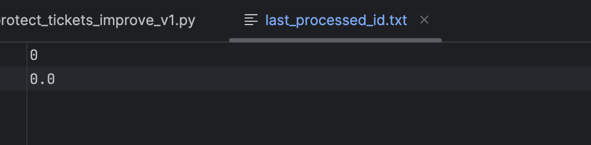

When addressing this problem, we need to be mindful of a few key challenges:

1. **Performance**: The database has 1 million records, so we need to be cautious when processing them in bulk. Loading the entire table into memory isn't a viable option.
2. **Memory Constraints**: We need to avoid loading all the data into memory at once to prevent running out of server memory.
3. **Interruptions**: If the process is interrupted, we want to save our progress so that the script can resume from where it left off without reprocessing the entire table.
4. **Progress Feedback**: The user needs to see how far along the process is and get an estimate of the time remaining.

Here's how I would approach solving the problem step-by-step:

### 1. Technical Analysis and Approach

The solution should:
- Use **Django ORM** to query the database in small chunks (batches) to avoid overloading memory.
- Ensure **UUID regeneration** for each row is unique and avoids duplication.
- Use a **checkpoint** system to track progress, allowing the script to resume after an interruption.
- Provide **progress updates and time estimation** by calculating based on how many records have been processed so far.

### 2. Database Model
- Let's assume the `Ticket` table has a column called `token` that contains the UUID values, and our goal is to regenerate these UUIDs.
- We can use an additional column (e.g., `processed` or `updated`) to mark rows that have already been updated, but in this case, we'll use a simpler approach by saving the ID of the last processed record.

### 3. Proposed Solution
Command in management:
- `protect_tickets` in myapp/management/commands/protect_tickets.py. Update UUID of each records
- `protect_tickets_improve_v1` in in myapp/management/commands/protect_tickets_improve_v1.py. Use `bulk_update` base on batch-size
- `protect_tickets_improve_v2` in in myapp/management/commands/protect_tickets_improve_v2.py. Use `bulk_update` base on batch-size and celery for Asynchronous Execution
- `protect_tickets_improve_v3` in in myapp/management/commands/protect_tickets_improve_v3.py. Use `bulk_update` base on batch-size and celery for Asynchronous Execution and use Redis to save checkpoint (replace save in file)


Here's the updated explanation in `README.md` to reflect the changes in the code:

### 4. Explanation of Key Parts
- **Batch Processing**: This code processes records base on batch-size at a time to avoid overloading memory by not loading the entire dataset at once.
- **UUID Regeneration**: For each record, a new UUID is generated using `uuid.uuid4()` and saved back to the database.
- **Checkpoint**: A checkpoint mechanism stores both the ID of the last processed record and the total elapsed time in a file called `last_processed_id.txt`. This ensures that if the script is interrupted, it can resume from where it left off, accurately accounting for the time spent before the interruption.
- **Progress Updates**: The script provides real-time updates to the user about how many records have been processed, including an estimate of the remaining time. The remaining time calculation is adjusted to account for any previous elapsed time, ensuring accuracy even after an interruption and resumption of the script.

### 5. Alternative Approaches and Trade-offs

**Alternative**: We could use a different checkpoint mechanism, such as storing the last processed ID in the database instead of using a file. This would be helpful if the server doesn't allow writing to the filesystem, or if we need more reliable progress tracking in a distributed environment.

**Memory Consideration**: If server memory is very limited, we could reduce the batch size from 1,000 to 500 or fewer. This would increase the total runtime, but it would reduce memory usage.

**Performance Consideration**: With 1 million records, this process may take some time. If performance is critical, we might consider adding an index on the `token` column (if not already present) to speed up the updates. However, we need to carefully assess whether this would interfere with other operations on the table.

### 6. Potential Improvements
- **Parallel Processing**: If the server has multiple CPU cores, we could process multiple batches in parallel to reduce overall runtime.
- **Asynchronous Execution**: We could offload this task to an asynchronous job queue using something like Celery, which would allow the task to run in the background and report progress more effectively.

This Django management command provides an efficient and safe way to regenerate UUIDs for 1 million records in the `Ticket` table while ensuring the process is memory-efficient, can resume from interruptions, and gives the user real-time progress updates.

-------


# How to Run This Project

Follow the steps below to set up and run the project, including how to create 1 million ticket records.

### 1. Build and Start the Project using Docker Compose

To build the Docker containers and start the project, run the following command:

```sh
docker-compose up --build -d
```

This command will:
- Build the Docker images for the project.
- Start the containers in detached mode (`-d` means detached, so it will run in the background).

### 2. Create 1 Million Ticket Records

Once the containers are up and running, you need to generate the 1 million ticket records. Follow these steps:

1. **Open a shell in the running `web` container**:
   - This will give you access to the Django environment inside the container.

   Run the following command to open a bash session inside the `web` container:

   ```sh
   docker-compose exec web bash
   ```

2. **Run the Django management command to create tickets**:
   - Inside the `web` container, run the following Django command to generate 1 million ticket records. You can adjust the `--batch-size` parameter if needed (in this example, it is set to 10,000 records per batch).

   ```sh
   python manage.py create_tickets --batch-size 10000
   ```

   This will:
   - Create the records in batches of 10,000.
   - Output the progress as the tickets are created.

### 3. Generate Tokens Again for 1 Million Ticket Records

You will now regenerate the UUID tokens for the 1 million ticket records using two different commands: `protect_tickets` and `protect_tickets_improve_v1`. The results are compared based on different batch sizes.
Please update `last_process_id.txt` file each time complete run command `0, 0,0` to run other command


#### 3.1 Using `protect_tickets` Command

Run the following command with a batch size of 10,000:

```sh
python manage.py protect_tickets --batch-size 10000
```

This will:
- Regenerate the UUID tokens for all ticket records using the original method.
- The progress and total time taken will be displayed.

    Result Screenshots: Please see in folder: `document/protect_tickets`


#### 3.2 Using `protect_tickets_improve_v1` Command
Improve with `bulk_update`

Run the following commands with different batch sizes to compare the performance:

- **Batch Size: 10,000**. Please update `last_process_id.txt` file each time complete run command `0, 0,0` to run other command

  ```sh
  python manage.py protect_tickets_improve_v1 --batch-size <number of batch-size>
  python manage.py protect_tickets_improve_v1 --batch-size 10000
  python manage.py protect_tickets_improve_v1 --batch-size 5000
  python manage.py protect_tickets_improve_v1 --batch-size 3000
  python manage.py protect_tickets_improve_v1 --batch-size 2000
  python manage.py protect_tickets_improve_v1 --batch-size 1000
  python manage.py protect_tickets_improve_v1 --batch-size 500
  ```
   Result Screenshots: Please see in folder: `document/protect_tickets_improve_v1`

  
#### 3.2 Using `protect_tickets_improve_v2` Command
Improve with `bulk_update` and run with Asynchronous Execution via `celery task`.

- **Batch Size: 5000, 3000, 2000, 1000, 500**. Please update `last_process_id.txt` file each time complete run command `0, 0,0` to run other command

  ```sh
  python manage.py protect_tickets_improve_v2 --batch-size <number of batch-size>
  python manage.py protect_tickets_improve_v2 --batch-size 5000
  python manage.py protect_tickets_improve_v2 --batch-size 3000
  python manage.py protect_tickets_improve_v2 --batch-size 2000
  python manage.py protect_tickets_improve_v2 --batch-size 1000
  python manage.py protect_tickets_improve_v2 --batch-size 500
  ```
   Result Screenshots: Please see in folder: `document/protect_tickets_improve_v2`

#### 3.3 Using `protect_tickets_improve_v3` Command
Improve with `bulk_update` and run with Asynchronous Execution via `celery task` and `Redis` to save checkpoint

- **Batch Size: 3000**

  ```sh
  python manage.py protect_tickets_improve_v2 --reset --batch-size <number of batch-size>
  python manage.py protect_tickets_improve_v2 --reset --batch-size 3000
  ```
   Result Screenshots: Please see in folder: `document/protect_tickets_improve_v3`

### 4. Comparison of Results
Factors such as CPU speed, number of cores, amount of RAM, disk type (SSD vs HDD), and overall system load can significantly impact the execution times and behavior of the commands.
The table below summarizes the results of regenerating UUID tokens using different commands and batch sizes:

| Command                        | Batch Size   | Time Taken (seconds)   | Observations                                                                                            | When to Use                                                                                                  |
|--------------------------------|--------------|------------------------|---------------------------------------------------------------------------------------------------------|--------------------------------------------------------------------------------------------------------------|
| `protect_tickets`              | 10,000       | 296 seconds            | Standard method: handle each record individually. Suitable for simple cases but not optimized.          | Use when working with smaller datasets or when simplicity is more important than performance.                |
| ------------------------------ | ------------ | ---------------------- | -------------------------------------------------------------                                           | -----------------------------------------------------------                                                  |
| `protect_tickets_improve_v1`   | 10,000       | 372.79 seconds         | Improved with `bulk_update`. Large batch size may cause I/O bottlenecks, leading to slower times.       | Use when processing large datasets but beware of potential I/O limits on the database.                       |
| `protect_tickets_improve_v1`   | 5,000        | 111.13 seconds         | Improved with `bulk_update` and smaller batch size. Balanced I/O and efficiency.                        | Use when seeking to balance performance with manageable I/O load on the database.                            |
| `protect_tickets_improve_v1`   | 3,000        | 98.40 seconds          | Further optimized for smaller batches. Reduced I/O strain while maintaining efficiency.                 | Ideal for moderately large datasets where database performance needs careful balancing.                      |
| `protect_tickets_improve_v1`   | 3,000        | 110.53 seconds         | With index in model. Indexes can slow down write operations slightly due to the need to update.         | Use when read performance is critical, but be cautious of slight write slowdowns.                            |
| `protect_tickets_improve_v1`   | 2,000        | 104.19 seconds         | Balances speed and resource usage effectively. Suitable for databases with moderate capabilities.       | Use when database resources are moderate, balancing between I/O load and processing efficiency.              |
| `protect_tickets_improve_v1`   | 1,000        | 123.75 seconds         | Slower, but less resource-intensive. Increased transaction overhead.                                    | Use when minimizing resource usage is a priority, despite slower overall performance.                        |
| `protect_tickets_improve_v1`   | 500          | 135.13 seconds         | Very small batch size. Increased transaction overhead, leading to slower performance.                   | Use when system resources are extremely limited or when running on systems with significant I/O limitations. |
| ------------------------------ | ------------ | ---------------------- | -----------------------------------------------------------                                             | -----------------------------------------------------------                                                  |
| `protect_tickets_improve_v2`   | 1,000        | 61.35 seconds          | Improved with `bulk_update` and Asynchronous Execution. Fast with smaller batch sizes.                  | Use when you can benefit from asynchronous execution and need to process small batches efficiently.          |
| `protect_tickets_improve_v2`   | 2,000        | 43.22 seconds          | Improved with `bulk_update` and Asynchronous Execution. Balanced speed and resource usage.              | Ideal when combining asynchronous processing with moderately large batches for faster results.               |
| `protect_tickets_improve_v2`   | 3,000        | 40.13 seconds          | Improved with `bulk_update` and Asynchronous Execution. Optimal performance for most cases.             | Recommended for general use when maximum performance is needed, balancing batch size and async tasks.        |
| `protect_tickets_improve_v2`   | 5,000        | 42.11 seconds          | Improved with `bulk_update` and Asynchronous Execution. Slight increase in time with larger batch size. | Use when slightly larger batches are manageable without causing significant delays or resource issues.       |
| `protect_tickets_improve_v2`   | 10,000       | System hangs           | Improved with `bulk_update` and Asynchronous Execution. Large batch size causes system hang.            | Avoid using very large batch sizes with asynchronous execution to prevent system overload.                   |
| ------------------------------ | ------------ | ---------------------- | -----------------------------------------------------------                                             | -----------------------------------------------------------                                                  |
| `protect_tickets_improve_v3`   | 3,000        | 40.16 seconds          | Improved with `bulk_update`, Asynchronous Execution, and Redis to save checkpoint. Best performance.    | Use when high performance is required, and you need reliable checkpointing for large datasets.               |

### Summary

- **Standard Method (`protect_tickets`)**:
  - **When to Use**: Use this method for smaller datasets or when the simplicity of implementation is a higher priority than performance. It is straightforward but not optimized for handling large datasets efficiently.

- **Large Batch Size (e.g., 10,000)**:
  - **When to Avoid**: While large batch sizes might seem efficient, they can hit I/O limits, causing slowdowns or even causing the system to hang, especially with asynchronous execution. It's better to avoid very large batch sizes unless you are sure that your database and system can handle the load.

- **Smaller Batch Sizes (e.g., 2,000 - 5,000)**:
  - **When to Use**: These sizes strike a good balance between performance and resource usage. They avoid excessive I/O bottlenecks while still taking advantage of batch processing efficiencies.

- **Very Small Batch Sizes (e.g., 500 - 1,000)**:
  - **When to Use**: Use when minimizing resource usage is crucial, such as on systems with limited I/O or memory. However, expect slower overall processing due to increased transaction overhead.

- **Asynchronous Execution (`protect_tickets_improve_v2`)**:
  - **When to Use**: Best suited for scenarios where you need to process data efficiently with the ability to handle tasks concurrently. Works well with moderately sized batches (2,000 - 5,000).

- **Redis for Checkpointing (`protect_tickets_improve_v3`)**:
  - **When to Use**: Recommended when processing large datasets, where you need to ensure that progress is saved reliably. The use of Redis for checkpointing adds resilience and reliability to the process, especially in long-running tasks.


