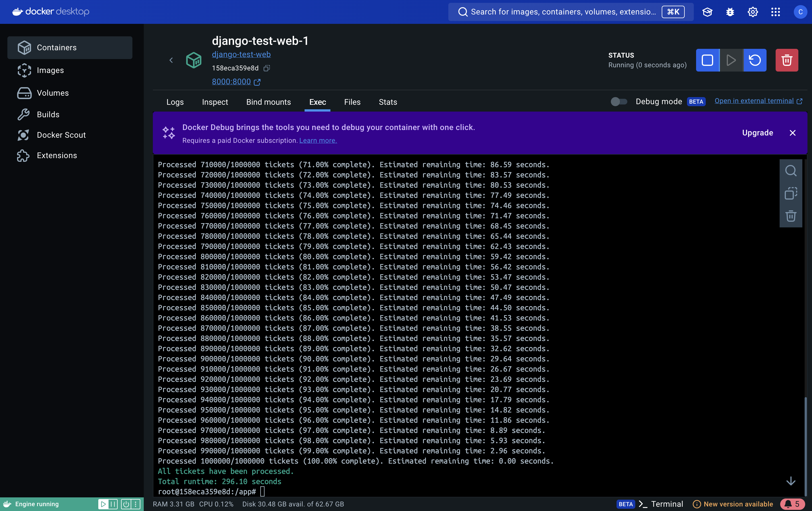

When addressing this problem, we need to be mindful of a few key challenges:

1. **Performance**: The database has 1 million records, so we need to be cautious when processing them in bulk. Loading the entire table into memory isn't a viable option.
2. **Memory Constraints**: We need to avoid loading all the data into memory at once to prevent running out of server memory.
3. **Interruptions**: If the process is interrupted, we want to save our progress so that the script can resume from where it left off without reprocessing the entire table.
4. **Progress Feedback**: The user needs to see how far along the process is and get an estimate of the time remaining.

Here's how I would approach solving the problem step-by-step:

### 1. Technical Analysis and Approach

The solution should:
- Use **Django ORM** to query the database in small chunks (batches) to avoid overloading memory.
- Ensure **UUID regeneration** for each row is unique and avoids duplication.
- Use a **checkpoint** system to track progress, allowing the script to resume after an interruption.
- Provide **progress updates and time estimation** by calculating based on how many records have been processed so far.

### 2. Database Model
- Let's assume the `Ticket` table has a column called `token` that contains the UUID values, and our goal is to regenerate these UUIDs.
- We can use an additional column (e.g., `processed`) to mark rows that have already been updated, but in this case, we'll use a simpler approach by saving the ID of the last processed record.

### 3. Proposed Solution

```python
import time
import uuid
from django.core.management.base import BaseCommand
from django.db import transaction
from myapp.models import Ticket

BATCH_SIZE = 1000  # Number of records to process in each batch

class Command(BaseCommand):
    help = 'Regenerates UUIDs for all Ticket records and updates them in batches'

    def add_arguments(self, parser):
        parser.add_argument(
            '--batch-size',
            type=int,
            help='Specify the size of batches to process at a time',
        )

    def handle(self, *args, **kwargs):
        batch_size = kwargs.get('batch_size', BATCH_SIZE)

        # Get the total number of records to report progress
        total_records = Ticket.objects.count()
        self.stdout.write(f"Total tickets: {total_records}")
        
        # Use a checkpoint to resume from where we left off
        last_processed_id = self.get_last_processed_ticket_id()
        
        start_time = time.time()

        while True:
            # Get a batch of records starting from last_processed_id
            tickets = Ticket.objects.filter(id__gt=last_processed_id).order_by('id')[:batch_size]

            if not tickets.exists():
                self.stdout.write(self.style.SUCCESS('All tickets have been processed.'))
                break

            # Process the current batch
            with transaction.atomic():  # Ensure data integrity
                for ticket in tickets:
                    ticket.token = uuid.uuid4()
                    ticket.save()

                last_ticket = tickets.last()
                last_processed_id = last_ticket.id
                self.save_last_processed_ticket_id(last_processed_id)

            # Calculate progress
            processed_records = Ticket.objects.filter(id__lte=last_processed_id).count()
            progress = (processed_records / total_records) * 100
            elapsed_time = time.time() - start_time
            estimated_total_time = (elapsed_time / processed_records) * total_records
            remaining_time = estimated_total_time - elapsed_time

            self.stdout.write(
                f"Processed {processed_records}/{total_records} tickets "
                f"({progress:.2f}% complete). "
                f"Estimated remaining time: {remaining_time:.2f} seconds."
            )

    def get_last_processed_ticket_id(self):
        """
        Returns the ID of the last processed record from the checkpoint.
        """
        # Assume we're using a simple file-based checkpoint system
        try:
            with open('last_processed_id.txt', 'r') as f:
                return int(f.read().strip())
        except FileNotFoundError:
            return 0

    def save_last_processed_ticket_id(self, last_processed_id):
        """
        Saves the ID of the last processed record so we can resume later.
        """
        with open('last_processed_id.txt', 'w') as f:
            f.write(str(last_processed_id))
```

### 4. Explanation of Key Parts
- **Batch Processing**: This code processes 1,000 records (or the user-specified number) at a time to avoid overloading memory by not loading the entire dataset at once.
- **UUID Regeneration**: For each record, we generate a new UUID using `uuid.uuid4()` and save it back to the database.
- **Checkpoint**: A simple checkpoint mechanism stores the ID of the last processed record in a file called `last_processed_id.txt`. This allows the script to resume from where it left off in case of an interruption.
- **Progress Updates**: The script provides real-time updates to the user about how much has been processed and estimates the remaining time based on the current progress.

### 5. Alternative Approaches and Trade-offs

**Alternative**: We could use a different checkpoint mechanism, such as storing the last processed ID in the database instead of using a file. This would be helpful if the server doesn't allow writing to the filesystem, or if we need more reliable progress tracking in a distributed environment.

**Memory Consideration**: If server memory is very limited, we could reduce the batch size from 1,000 to 500 or fewer. This would increase the total runtime, but it would reduce memory usage.

**Performance Consideration**: With 1 million records, this process may take some time. If performance is critical, we might consider adding an index on the `token` column (if not already present) to speed up the updates. However, we need to carefully assess whether this would interfere with other operations on the table.

### 6. Potential Improvements
- **Parallel Processing**: If the server has multiple CPU cores, we could process multiple batches in parallel to reduce overall runtime.
- **Asynchronous Execution**: We could offload this task to an asynchronous job queue using something like Celery, which would allow the task to run in the background and report progress more effectively.

This Django management command provides an efficient and safe way to regenerate UUIDs for 1 million records in the `Ticket` table while ensuring the process is memory-efficient, can resume from interruptions, and gives the user real-time progress updates.

-------

Here’s a more detailed and clearer `README.md` that provides step-by-step instructions on how to run the project:

---

# How to Run This Project

Follow the steps below to set up and run the project, including how to create 1 million ticket records.

### 1. Build and Start the Project using Docker Compose

To build the Docker containers and start the project, run the following command:

```sh
docker-compose up --build -d
```

This command will:
- Build the Docker images for the project.
- Start the containers in detached mode (`-d` means detached, so it will run in the background).

### 2. Create 1 Million Ticket Records

Once the containers are up and running, you need to generate the 1 million ticket records. Follow these steps:

1. **Open a shell in the running `web` container**:
   - This will give you access to the Django environment inside the container.

   Run the following command to open a bash session inside the `web` container:

   ```sh
   docker-compose exec web bash
   ```

2. **Run the Django management command to create tickets**:
   - Inside the `web` container, run the following Django command to generate 1 million ticket records. You can adjust the `--batch-size` parameter if needed (in this example, it is set to 10,000 records per batch).

   ```sh
   python manage.py create_tickets --batch-size 10000
   ```

   This will:
   - Create the records in batches of 10,000.
   - Output the progress as the tickets are created.

### 3. Generate token again for 1 Million Ticket Records

```sh
python manage.py protect_tickets --batch-size 10000
```



```sh
python manage.py protect_tickets_improve_v1 --batch-size 1000
```
