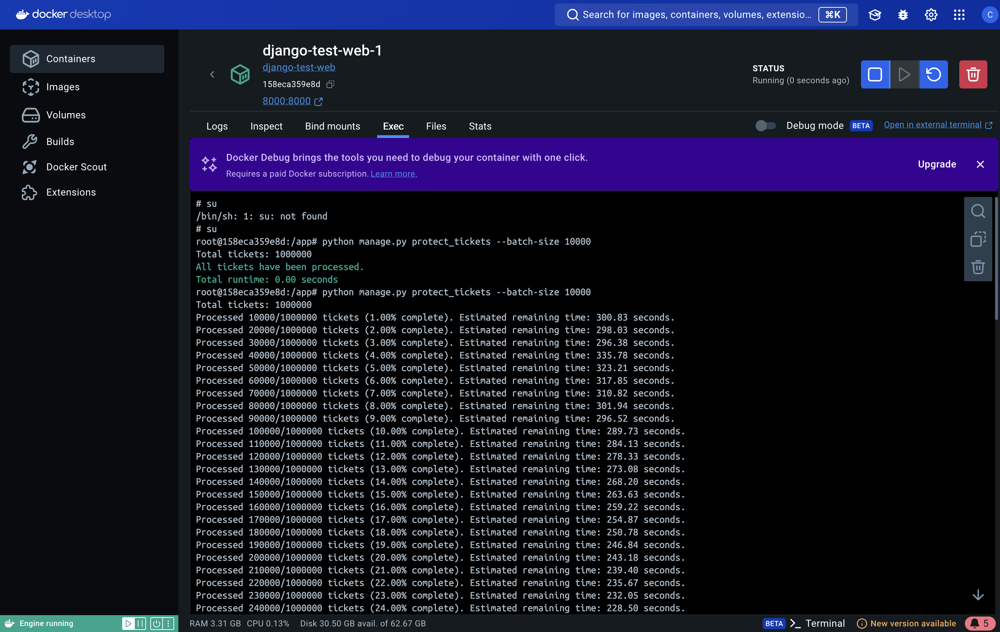

When addressing this problem, we need to be mindful of a few key challenges:

1. **Performance**: The database has 1 million records, so we need to be cautious when processing them in bulk. Loading the entire table into memory isn't a viable option.
2. **Memory Constraints**: We need to avoid loading all the data into memory at once to prevent running out of server memory.
3. **Interruptions**: If the process is interrupted, we want to save our progress so that the script can resume from where it left off without reprocessing the entire table.
4. **Progress Feedback**: The user needs to see how far along the process is and get an estimate of the time remaining.

Here's how I would approach solving the problem step-by-step:

### 1. Technical Analysis and Approach

The solution should:
- Use **Django ORM** to query the database in small chunks (batches) to avoid overloading memory.
- Ensure **UUID regeneration** for each row is unique and avoids duplication.
- Use a **checkpoint** system to track progress, allowing the script to resume after an interruption.
- Provide **progress updates and time estimation** by calculating based on how many records have been processed so far.

### 2. Database Model
- Let's assume the `Ticket` table has a column called `token` that contains the UUID values, and our goal is to regenerate these UUIDs.
- We can use an additional column (e.g., `processed` or `updated`) to mark rows that have already been updated, but in this case, we'll use a simpler approach by saving the ID of the last processed record.

### 3. Proposed Solution
Command in management:
- `protect_tickets` in myapp/management/commands/protect_tickets.py. Update UUID of each records
- `protect_tickets_improve_v1` in in myapp/management/commands/protect_tickets_improve_v1.py. Use `bulk_update` base on batch-size


Here's the updated explanation in `README.md` to reflect the changes in the code:

### 4. Explanation of Key Parts
- **Batch Processing**: This code processes records base on batch-size at a time to avoid overloading memory by not loading the entire dataset at once.
- **UUID Regeneration**: For each record, a new UUID is generated using `uuid.uuid4()` and saved back to the database.
- **Checkpoint**: A checkpoint mechanism stores both the ID of the last processed record and the total elapsed time in a file called `last_processed_id.txt`. This ensures that if the script is interrupted, it can resume from where it left off, accurately accounting for the time spent before the interruption.
- **Progress Updates**: The script provides real-time updates to the user about how many records have been processed, including an estimate of the remaining time. The remaining time calculation is adjusted to account for any previous elapsed time, ensuring accuracy even after an interruption and resumption of the script.

### 5. Alternative Approaches and Trade-offs

**Alternative**: We could use a different checkpoint mechanism, such as storing the last processed ID in the database instead of using a file. This would be helpful if the server doesn't allow writing to the filesystem, or if we need more reliable progress tracking in a distributed environment.

**Memory Consideration**: If server memory is very limited, we could reduce the batch size from 1,000 to 500 or fewer. This would increase the total runtime, but it would reduce memory usage.

**Performance Consideration**: With 1 million records, this process may take some time. If performance is critical, we might consider adding an index on the `token` column (if not already present) to speed up the updates. However, we need to carefully assess whether this would interfere with other operations on the table.

### 6. Potential Improvements
- **Parallel Processing**: If the server has multiple CPU cores, we could process multiple batches in parallel to reduce overall runtime.
- **Asynchronous Execution**: We could offload this task to an asynchronous job queue using something like Celery, which would allow the task to run in the background and report progress more effectively.

This Django management command provides an efficient and safe way to regenerate UUIDs for 1 million records in the `Ticket` table while ensuring the process is memory-efficient, can resume from interruptions, and gives the user real-time progress updates.

-------

Here’s a more detailed and clearer `README.md` that provides step-by-step instructions on how to run the project:

---

Here’s the updated `README.md` with the comparison table included, combining sections 3 and 4:

---

# How to Run This Project

Follow the steps below to set up and run the project, including how to create 1 million ticket records.

### 1. Build and Start the Project using Docker Compose

To build the Docker containers and start the project, run the following command:

```sh
docker-compose up --build -d
```

This command will:
- Build the Docker images for the project.
- Start the containers in detached mode (`-d` means detached, so it will run in the background).

### 2. Create 1 Million Ticket Records

Once the containers are up and running, you need to generate the 1 million ticket records. Follow these steps:

1. **Open a shell in the running `web` container**:
   - This will give you access to the Django environment inside the container.

   Run the following command to open a bash session inside the `web` container:

   ```sh
   docker-compose exec web bash
   ```

2. **Run the Django management command to create tickets**:
   - Inside the `web` container, run the following Django command to generate 1 million ticket records. You can adjust the `--batch-size` parameter if needed (in this example, it is set to 10,000 records per batch).

   ```sh
   python manage.py create_tickets --batch-size 10000
   ```

   This will:
   - Create the records in batches of 10,000.
   - Output the progress as the tickets are created.

### 3. Generate Tokens Again for 1 Million Ticket Records

You will now regenerate the UUID tokens for the 1 million ticket records using two different commands: `protect_tickets` and `protect_tickets_improve_v1`. The results are compared based on different batch sizes.

#### 3.1 Using `protect_tickets` Command

Run the following command with a batch size of 10,000:

```sh
python manage.py protect_tickets --batch-size 10000
```

This will:
- Regenerate the UUID tokens for all ticket records using the original method.
- The progress and total time taken will be displayed.

**Result Screenshots:**

- 
- 

#### 3.2 Using `protect_tickets_improve_v1` Command

Run the following commands with different batch sizes to compare the performance:

- **Batch Size: 10,000**

  ```sh
  python manage.py protect_tickets_improve_v1 --batch-size 10000
  ```
   Result Screenshots:

- 
- 

- **Batch Size: 5,000**

  ```sh
  python manage.py protect_tickets_improve_v1 --batch-size 5000
  ```

- **Batch Size: 3,000**

  ```sh
  python manage.py protect_tickets_improve_v1 --batch-size 3000
  ```

- **Batch Size: 2,000**

  ```sh
  python manage.py protect_tickets_improve_v1 --batch-size 2000
  ```

- **Batch Size: 1,000**

  ```sh
  python manage.py protect_tickets_improve_v1 --batch-size 1000
  ```

- **Batch Size: 500**

  ```sh
  python manage.py protect_tickets_improve_v1 --batch-size 500
  ```

### 4. Comparison of Results

The table below summarizes the results of regenerating UUID tokens using different commands and batch sizes:

| Command                        | Batch Size | Time Taken (seconds) | Observations                                              |
|--------------------------------|------------|----------------------|-----------------------------------------------------------|
| `protect_tickets`              | 10,000     | 296 seconds          | Standard method: handle each record                       |
| `protect_tickets_improve_v1`   | 10,000     | 372.79 seconds       | Improved method with `bulk_update`                        |
| `protect_tickets_improve_v1`   | 5,000      | 111.13 seconds       | Improved method with `bulk_update` and smaller batch size |
| `protect_tickets_improve_v1`   | 3,000      | 98.40 seconds        | Further optimized for smaller batches                     |
| `protect_tickets_improve_v1`   | 2,000      | 104.19 seconds       | Balancing speed and resource usage                        |
| `protect_tickets_improve_v1`   | 1,000      | 123.75 seconds       | Slower, but less resource-intensive                       |
| `protect_tickets_improve_v1`   | 500        | 135.13 seconds       | Very small batch size, might be the slowest               |

---

### Specific to Observations:
- **Standard Method (protect_tickets)**: The first row shows the time taken by the standard method, which processes each record individually. With a batch size of 10,000, it took 296 seconds. This method is straightforward but may not be optimized for handling large datasets efficiently.

- **Large Batch Size (10,000)**: When using a large batch size, you might be hitting the I/O limits of your database. The larger the batch, the more data the database needs to write at once, potentially causing I/O bottlenecks. This could explain why the time taken increased with a larger batch size despite using `bulk_update`.
  
- **Smaller Batch Sizes (3,000 - 5,000)**: These seem to provide a better balance because they likely stay within the database’s optimal performance window, avoiding excessive I/O bottlenecks while still benefiting from the efficiency of batch processing.

- **Very Small Batch Sizes (500 - 1,000)**: These batches might reduce immediate I/O strain, but they increase the number of transactions and overhead, as each batch still requires separate processing. This could lead to more time being spent on transaction management and less on actual data processing.

